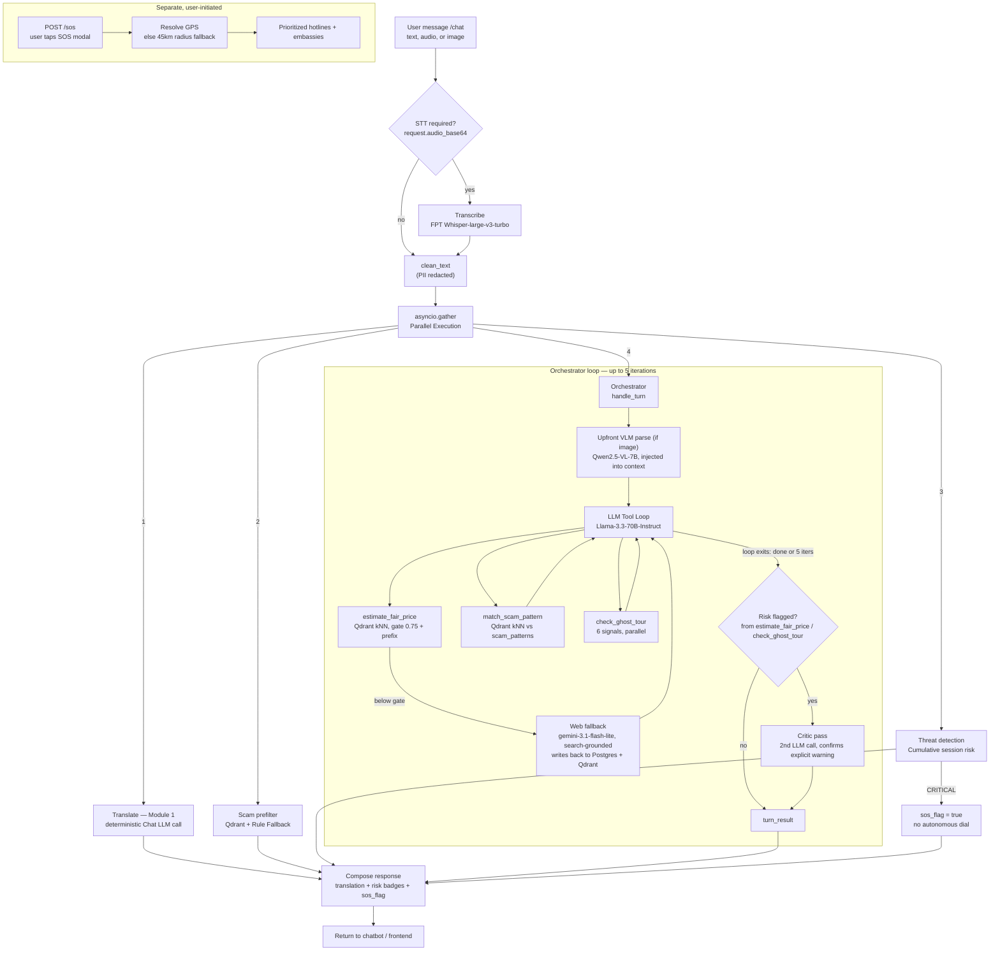

# AITravelMate — `/chat` Orchestration Flow

Deterministic pre/post pipeline wraps a bounded agentic tool loop. Only 3 tools are exposed to the LLM — `check_ghost_tour`'s 6 signals run internally/in parallel rather than as separate LLM-chosen tool calls, keeping tool-choice cheap. SOS is fully outside the agentic loop and only ever user-initiated.

**Legend**
- Solid arrow = always executes. Dashed/labeled branch = conditional.
- `ORCH` subgraph = the only part of `/chat` where the LLM chooses actions; everything outside it is a fixed deterministic pipeline.
- `SOS` subgraph = never reachable from inside `/chat` or the tool loop — matches the hard rule that the agent cannot autonomously trigger SOS.